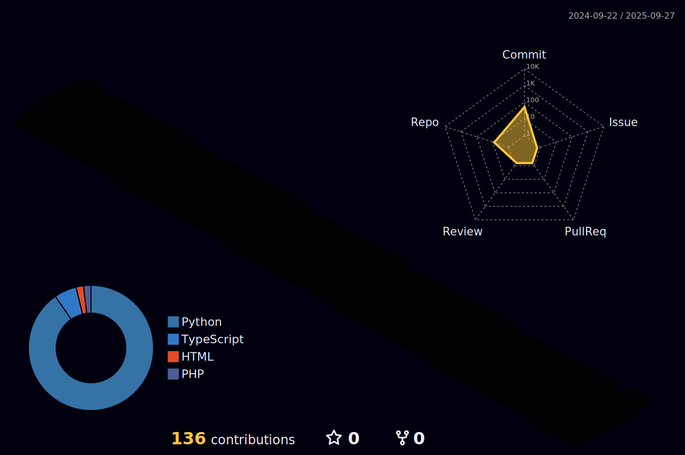

# Hello, I'm soooogo! 👋

Welcome to my GitHub profile! Here are some of my projects and interests.

## Profile

### GitHub Statistics

  <picture>
    <source media="(prefers-color-scheme: dark)" srcset="https://github-readme-stats.vercel.app/api?username=soooogo&show_icons=true&locale=en&theme=dark&hide_border=true&bg_color=0D1117" />
    <source media="(prefers-color-scheme: light)" srcset="https://github-readme-stats.vercel.app/api?username=soooogo&show_icons=true&locale=en&theme=default&hide_border=true" />
    
  </picture>

### Top Languages

  <picture>
    <source media="(prefers-color-scheme: dark)" srcset="https://github-readme-stats.vercel.app/api/top-langs/?username=soooogo&layout=compact&theme=dark&hide_border=true&bg_color=0D1117" />
    <source media="(prefers-color-scheme: light)" srcset="https://github-readme-stats.vercel.app/api/top-langs/?username=soooogo&layout=compact&theme=default&hide_border=true" />
    
  </picture>

### GitHub Achievements

  <picture>
    <source media="(prefers-color-scheme: dark)" srcset="output/metrics.plugin.achievements.compact.svg" width="400" />
    <source media="(prefers-color-scheme: light)" srcset="output/metrics.plugin.achievements.compact.svg" width="400" />
    
  </picture>

### 3D Profile Contribution Chart

  <picture>
    <source media="(prefers-color-scheme: dark)" srcset="profile-3d-contrib/profile-night-rainbow.svg" width="700" />
    <source media="(prefers-color-scheme: light)" srcset="profile-3d-contrib/profile-season-animate.svg" width="700" />
    
  </picture>

## Skills

- **Languages**: JavaScript, Python, Java
- **Frameworks**: React, Next.js, FastAPI
- **Tools**: Git, Docker, VS Code

## Connect with me

- [GitHub](https://github.com/soooogo)
- [LinkedIn](https://www.linkedin.com/in/soooogo/)
- [Twitter](https://twitter.com/soooogo)